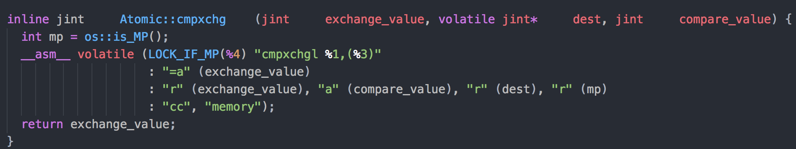

<!-- TOC -->

- [锁](#锁)
    - [乐观锁](#乐观锁)
    - [悲观锁](#悲观锁)
- [CAS原理](#cas原理)
    - [CAS概述](#cas概述)
    - [CAS底层实现](#cas底层实现)
    - [CAS实现(Java/C++)](#cas实现javac)
- [自旋锁](#自旋锁)
    - [自旋锁和互斥锁](#自旋锁和互斥锁)
    - [自旋锁的实现](#自旋锁的实现)
    - [自旋锁的问题](#自旋锁的问题)
- [排队自旋锁](#排队自旋锁)
    - [排队自旋锁实现](#排队自旋锁实现)
    - [排队自旋锁问题](#排队自旋锁问题)
- [CLH自旋锁](#clh自旋锁)
    - [CLH自旋锁实现](#clh自旋锁实现)
    - [CLH自旋锁问题](#clh自旋锁问题)
- [MSC自旋锁](#msc自旋锁)
    - [MSC自旋锁实现](#msc自旋锁实现)

<!-- /TOC -->
# 锁
## 乐观锁
> 一种**无锁**的设计思想，在多线程并发时，总是认为最好情况，即锁的竞争不存在，乐观锁适用于竞争较小，线程等锁时间较短的场景，一般用于**多读少写**的场景。具体实现有两种方式如下：
> 1. **CAS：** 使用底层CPU硬件提供的CAS指令和自旋实现 - [CAS原理](#CAS原理)
> 2. **版本控制：** 在数据上绑定版本号，业务线程在读取数据库中数据和对应的版本号进行业务处理后，更新数据回数据库时：
>    + 首先判断业务线程中数据的版本号和数据库中当前版本号是否一致
>    + 一致，则更新成功，数据库中数据版本+1
>    + 不一致，则更新失败，业务线程放弃当前持有的数据，重新读取数据库中数据和对应的版本，重新进行业务处理和上述更新操作，直到更新成功

## 悲观锁
>一种**有锁**的设计思想，在多线程并发时，总是认为最坏的情况，同一时刻只允许一个线程获得锁，其他线程被阻塞挂起，悲观锁适用于竞争比较激烈且同步代码执行时间较长的场景
# CAS原理
## CAS概述
> **CAS(Compare And Swap):** 比较并交换，
## CAS底层实现
1. Linux实现

2. Windows实现
    ```cpp
    inline jint Atomic::cmpxchg (jint exchange_value, volatile jint* dest, jint compare_value) {
        int mp = os::isMP(); #判断是否是多处理器
        _asm {
            mov edx, dest  #变量内存位置放edx
            mov ecx, exchange_value  #要更新的值放ecx
            mov eax, compare_value #原内存值放eax
            LOCK_IF_MP(mp) #决定是否Lock
            #这句是真正的CAS操作
            cmpxchg dword ptr [edx], ecx
            # dword ptr 将 [edx] 强制类型转换成双字
            # cmpxchg 将 eax 里 内存原值 与（转换后的）对象值 比较
            # 如果相等，就是没别的线程在改变这个对象，那么这个线程就可以改了，将ecx值更新到这个对象。
        }
    }
    ```
3. 实现细节
   
   <!DOCTYPE html>
    <html>
        <table>
            <thead bgcolor="#BCF4EC">
                <tr>
                    <th style="text-align:center" width=100px>概念</th>
                    <th style="text-align:center">描述</th>
                </tr>
            </thead>
            <tbody>
                <tr>
                    <td style="text-align:right"><strong>lock</strong></td>
                    <td style="text-align:left">总线锁指令， 多核CPU中，一个CPU在执行带有lock前缀的指令时，会锁住总线，防止其他CPU通过总线去访问内存，保证了指令执行的原子性。总线锁性能开销很大，可以通过缓存锁的方式优化性能</td>
                </tr>
                <tr>
                    <td style="text-align:right"><strong>缓存锁</strong></td>
                    <td style="text-align:left">多核CPU中，一个CPU访问共享变量时，会锁住该共享变量内存对应的缓存行，从而使得其他CPU无法读/写该缓存行对应的内存，这样CPU就可以不通过总线锁而实现共享变量的原子操作了。缓存锁可以极大的优化lock指令的性能开销，但如果指令操作的<strong>内存地址未对齐、跨越多个缓存行、跨总线</strong>等情况，则lock指令会使用总线锁</td>
                </tr>
            </tbody>
        </table>
    </html>  

## CAS实现(Java/C++)
# 自旋锁
## 自旋锁和互斥锁

<!DOCTYPE html>
<html>
    <table>
        <thead bgcolor="#BCF4EC">
            <tr>
                <th ></th>
                <th style="text-align:center">自旋锁</th>
                <th style="text-align:center">互斥锁</th>
            </tr>
        </thead>
        <tbody>
            <tr>
                <td style="text-align:right"><strong>定义</strong></td>
                <td  width="50%" style="text-align:left">1.乐观锁<br>2.同一时刻只有一个线程可以获取锁，其他未获取锁的线程自旋<br>3.未获得锁的线程自旋期间会消耗CPU资源</td>
                <td  width="50%" style="text-align:left">1.悲观锁<br>2.同一时刻只有一个线程获得锁资源，其他未获得锁的线程被挂起，等待获得锁的线程释放互斥量后，由系统唤醒（挂起和唤醒线程需要上下文切换，会带来系统开销）<br>3.未获得锁的线程挂起期间不会消耗CPU资源</td>
            </tr>
            <tr>
                <td style="text-align:right"><strong>适用场景</strong></td>
                <td style="text-align:left">1.一般适用于多核CPU（单核CPU中一般不推荐使用自旋锁）<br>2.竞争不激烈且同步代码执行时间较短（小于两次线程上下文切换的时间）</td>
                <td style="text-align:left">1.竞争比较激烈且同步代码执行时间较长（大于两次线程上下文切换的时间）</td>
            </tr>
        </tbody>
    </table>
</html>

## 自旋锁的实现
## 自旋锁的问题
# 排队自旋锁
## 排队自旋锁实现
## 排队自旋锁问题
# CLH自旋锁
## CLH自旋锁实现
## CLH自旋锁问题
# MSC自旋锁
## MSC自旋锁实现

~未完待续~